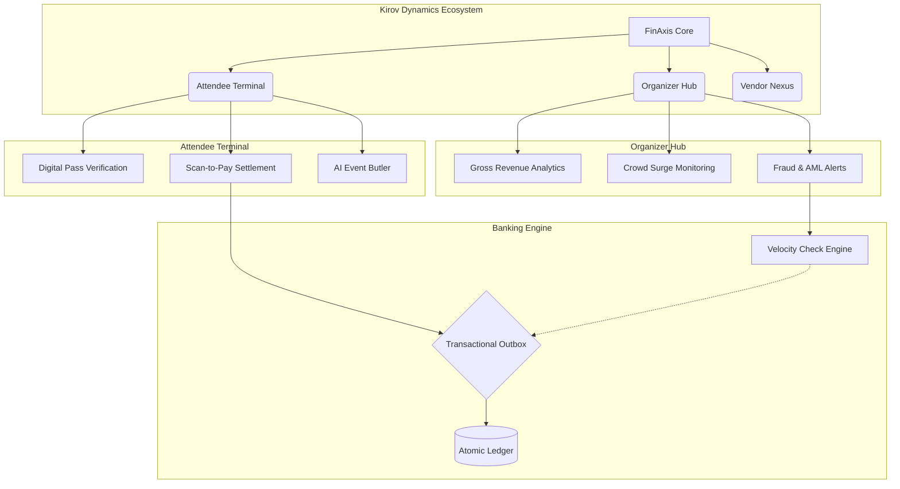
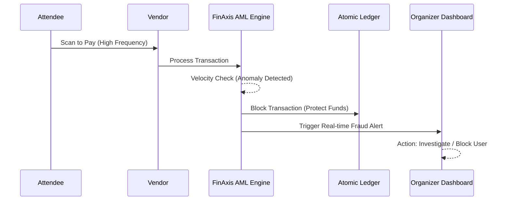

# 🏦 KIROV DYNAMICS | FINAXIS EVENT ECOSYSTEM
**Created by Kirov Dynamics Technology**

Welcome to **FinAxis**, a high-fidelity, all-in-one Event Management Ecosystem and Distributed Banking platform. Designed for all kinds of events—from music festivals and tech summits to sports arenas and corporate conferences—FinAxis provides a dual-sided engine catering to both Attendees and Event Organizers, demonstrating elite AI Infrastructure Engineering.

---

## 🚀 Live Demonstration
The mobile-first web ecosystem is currently live and optimized for performance. It acts as a comprehensive "Testing App" with functional logins, onboarding, and interactive modules.

👉 **[Access the Localhost Preview](http://127.0.0.1:8081)**
*(If running locally via `http-server`)*

---

## 🏗️ Ecosystem Architecture

The FinAxis system seamlessly transitions from a traditional double-entry core banking engine into a dynamic, real-time Event Hub.

### 1. Attendee Experience
A premium, frictionless interface for festival and summit attendees:
*   **Digital Pass**: QR-based entry verification for seamless gate access.
*   **Scan-to-Pay**: Instant, cashless authorization for event services and merchandise.
*   **AI Integration**: Proactive event guidance, schedule management, and instant support.
*   **Event Wallet (Settlement Core)**: Integrated credit management with atomic ledger updates.

### 2. Organizer Dashboard
Powerful, real-time analytics for event managers:
*   **Gross Revenue Tracking**: Dynamic visualization of total volume and vendor performance.
*   **Crowd Surge Monitoring**: Heatmaps and density tracking across event zones to ensure safety.
*   **Fraud Detection (AML)**: Built-in velocity checks and security alerts to prevent revenue loss.

---

## 🛡️ Security & Revenue Protection
FinAxis is built with banking-grade compliance to ensure funds and data remain secure at all times.

*   **Transactional Outbox Pattern**: Ensures payments are processed reliably.
*   **Ledger Integrity**: ACID-compliant account-ledger service prevents tampering.
*   **Scan-to-Pay Security**: Reduces cash handling risks.

---

## 📊 Applicable Event Types
FinAxis is designed to scale dynamically across industries:
1.  **Music Festivals & Concerts**: Manage massive crowds, multiple vendors, and rapid entry.
2.  **Corporate Summits & Conferences**: Provide VIP networking, scheduling, and premium catering payments.
3.  **Sports Tournaments**: Handle high-volume concession sales and stadium seating access.
4.  **Trade Shows & Expos**: Monitor booth engagement and vendor revenue analytics.

---

## 📂 Project Structure
*   `finaxis_web/`: The official Next.js/Static Web App Experience.
*   `account-ledger-service/`: ACID-compliant banking core.
*   `payment-service/`: Orchestrated movement of event credits.
*   `fraud-aml-service/`: Kafka-driven velocity fraud detection logic.

*(Note: Database integration is scheduled as a future feature post-launch. The current iteration uses simulated transactional states for demonstration purposes.)*

---
*Created by Kirov Dynamics Technology*
