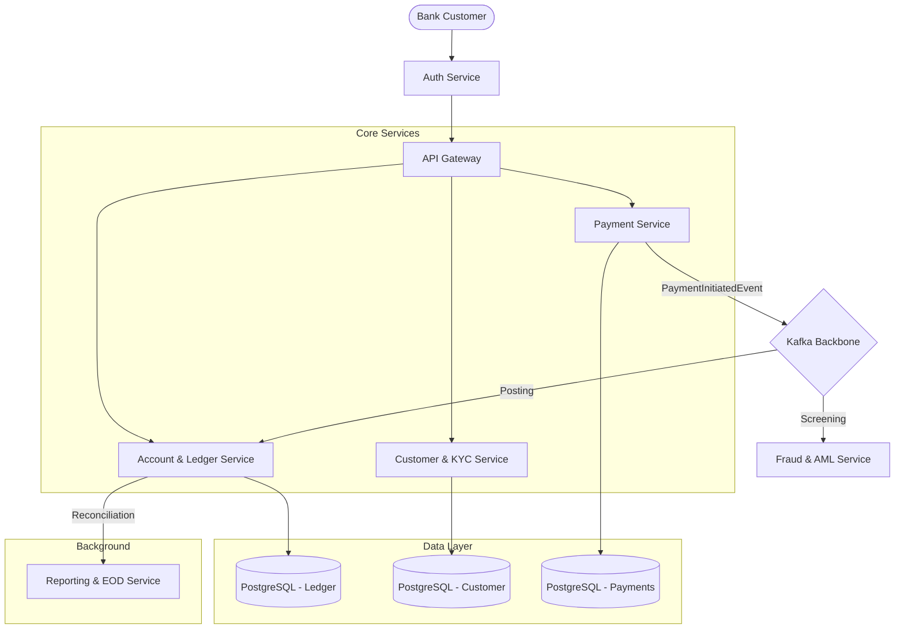

# FinAxis: Enterprise Core Banking & Payments Platform

Welcome to **FinAxis**, a senior-level distributed banking platform designed for high-availability, strong consistency, and bank-grade security.

## 🏗️ Architecture Overview

The system is built using **Hexagonal Architecture** and follows **Domain-Driven Design (DDD)** principles. Inter-service communication is handled via **Kafka** for eventual consistency, while the **Ledger** maintains strict ACID guarantees.



## 🧠 Key Senior Patterns Implied
- **Double-Entry Ledger**: Immutable audit trail of every cent (Journal entries).
- **Saga Pattern**: Distributed transaction management across Payment and Ledger services.
- **Outbox Pattern**: Ensuring reliable event publishing (Ready for implementation).
- **Optimistic Locking**: Handled via JPA `@Version` to prevent race conditions.
- **Idempotency**: All posting operations are keyed by unique correlation IDs.

## 🛠️ Technical Stack
- **Backend**: Java 17+, Spring Boot 3.2, Spring Data JPA.
- **Messaging**: Apache Kafka.
- **Database**: PostgreSQL (Relational) & Redis (Caching/Locks).
- **Infrastructure**: Docker & Docker Compose.

## 🚀 Getting Started

1. **Prerequisites**: Docker, Java 17, Maven.
2. **Start Infrastructure**:
   ```bash
   docker-compose up -d
   ```
3. **Build Services**:
   ```bash
   mvn clean install
   ```

## 📂 Project Structure
- `account-ledger-service/`: The heart of the platform. ACID guarantees & Journaling.
- `payment-service/`: Orchestrates money movement (Saga).
- `customer-service/`: Onboarding and KYC status management.
- `fraud-aml-service/`: Real-time velocity checks and screening.
- `auth-service/`: RBAC/ABAC and OAuth2 security.
- `reporting-service/`: EOD jobs and regulatory reports.
- `shared-kernel/`: Common DTOs and Kafka Events.
- `finaxis_mobile/`: **New Premium Flutter App** for institutional spending.

## 📱 Mobile Experience (Flutter)

The **FinAxis Mobile** app provides a premium **Light Mode** experience for retail and institutional clients.

### Key Mobile Features:
- **Biometric Security**: Secure FaceID/TouchID entry simulation via a dedicated Lock Screen.
- **Interactive Velocity Charts**: Weekly spending visualization that updates dynamically as you spend.
- **Instant Expenditure**: "Tap to Pay" simulation that executes a real-time atomic debit against the Ledger.
- **Premium Design System**: Institutional Grade Light Mode with Micro-Animations.

### How to run:
1. Ensure [Flutter SDK](https://docs.flutter.dev/) is installed.
2. `cd finaxis_mobile`
3. `flutter run`
