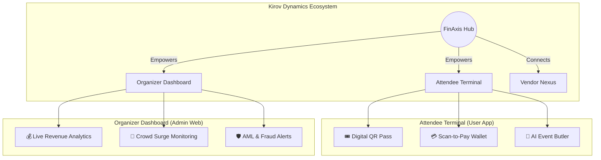
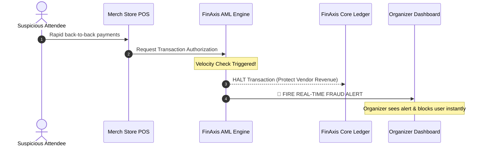

# 🏦 KIROV DYNAMICS | FINAXIS EVENT ECOSYSTEM
**Created by Kirov Dynamics Technology**

Welcome to **FinAxis**, the ultimate high-fidelity Event Management Ecosystem and Distributed Banking platform. 

Whether you are hosting a music festival, a tech summit, a sports arena event, or a corporate conference, FinAxis provides a complete digital infrastructure. By combining real-time attendee engagement with powerful organizer analytics and institutional-grade security, FinAxis redefines the live event experience.

---

## 🚀 Live Demonstration

The FinAxis platform is live and fully interactive! We have built a complete, production-grade Next.js testing application for you to explore. 

👉 **[Launch FinAxis Web App (Live on Vercel)](https://finaxis-ptwupjsju-raphashakoketso69-3253s-projects.vercel.app)**

*Try logging in and switching between the **Attendee** and **Organizer** roles to see how the platform dynamically adapts.*

---

## 🏗️ How FinAxis Works (The Ecosystem)

FinAxis is a dual-sided platform. It gives attendees a premium, frictionless experience while giving organizers absolute control and real-time visibility over their events.

### 📱 For Attendees: The Ultimate Digital Pass
*   **Digital Pass**: Say goodbye to paper tickets. Attendees use a secure, dynamic QR code for seamless gate access.
*   **Scan-to-Pay Wallet**: Instant, zero-wait-time payments for food, drinks, and merch. No cash required.
*   **AI Event Butler**: A smart chat assistant that helps attendees find vendors, check schedules, and navigate the venue.

### 💻 For Organizers: The Command Center
*   **Live Revenue Tracking**: Watch sales come in across all vendors in real-time.
*   **Crowd Monitoring**: Track attendee density across different zones (Mainstage, VIP, Merch) to ensure safety and prevent overcrowding.
*   **Velocity Protection**: An automated security engine that stops fraudulent payments before they happen.

---

## 🛡️ Security: Protecting Your Revenue

FinAxis doesn't just process payments; it protects them. Built on banking-grade architecture, our system acts as a shield against theft and fraud. 

Here is exactly how FinAxis handles a suspicious transaction at your event:

1. **Detection**: If someone tries to rapidly spend stolen credits, the Anti-Money Laundering (AML) engine detects the anomaly immediately.
2. **Protection**: The transaction is blocked before the vendor loses any product.
3. **Action**: The organizer gets a red alert on their dashboard and can instantly revoke the attendee's digital pass.

---

## 🗄️ Next-Generation Database Integration (Supabase)

The current version of FinAxis serves as a high-fidelity frontend showcase, utilizing simulated state management for immediate demonstration. 

**Upcoming Infrastructure Upgrade:**
To achieve true global scale, this project is architected to connect directly to **Supabase**—our highly recommended backend-as-a-service. 

By integrating Supabase, FinAxis will leverage:
*   **High-Performance PostgreSQL**: Providing ACID-compliant ledger storage for absolute financial accuracy.
*   **Real-time WebSockets**: Ensuring the Organizer Dashboard updates instantly the millisecond a transaction occurs at a vendor terminal.
*   **Row Level Security (RLS)**: Guaranteeing that attendees can only ever access their own wallets, preventing data leaks.

---

## 🌍 Built for Any Scale

FinAxis dynamically scales to fit your industry:
1.  🎸 **Music Festivals**: Manage massive crowds, hundreds of food trucks, and rapid gate entry.
2.  👔 **Corporate Summits**: Provide VIP networking tools and premium catering payments.
3.  ⚽ **Sports Tournaments**: Handle halftime concession rushes with zero lag.
4.  🎪 **Trade Shows**: Monitor booth engagement and vendor analytics in real-time.

---
*Architected and Engineered by Kirov Dynamics Technology*
